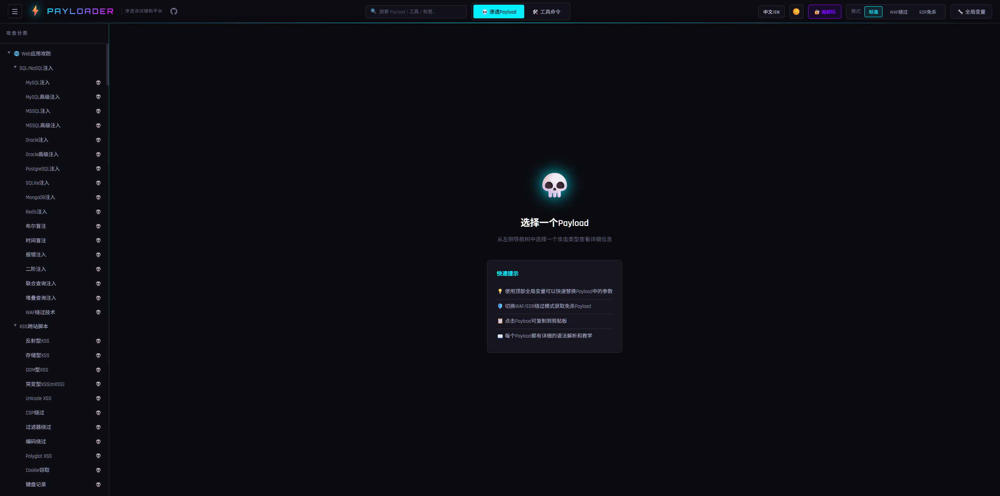
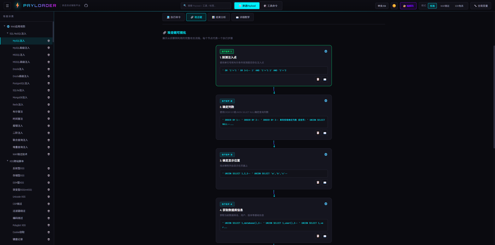
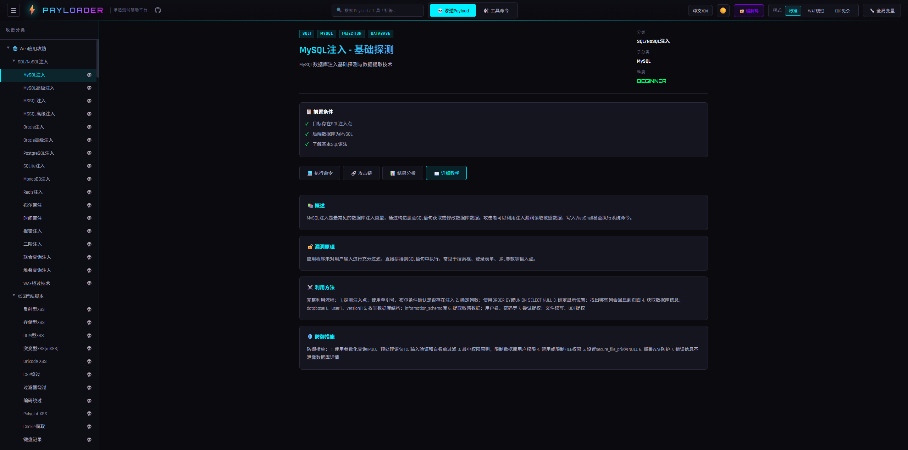
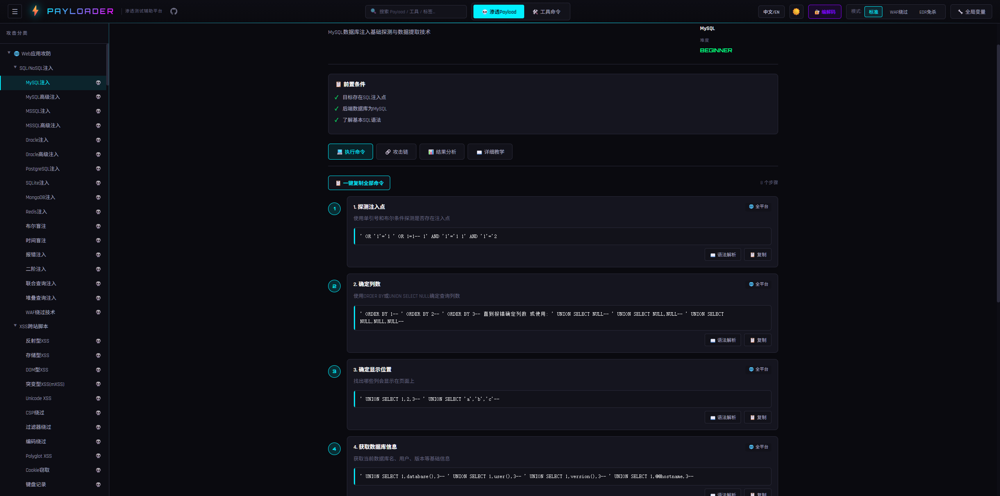
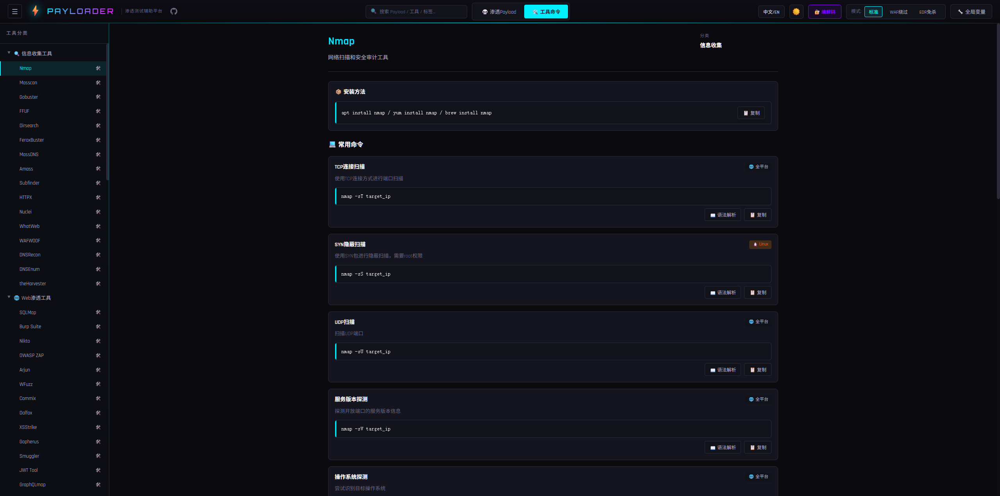
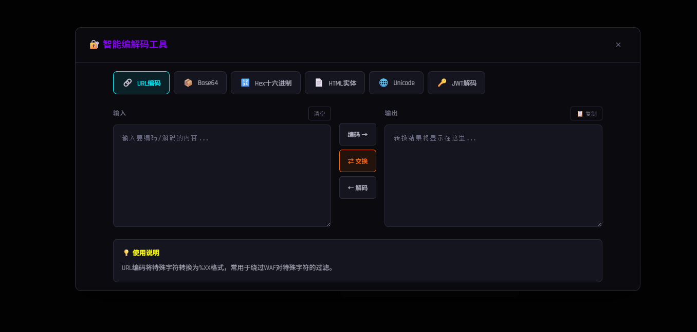

<div align="center">

# ⚡ Payloader — 渗透测试辅助平台

[](https://react.dev)
[](https://www.typescriptlang.org)
[](https://vite.dev)
[](LICENSE)
[](https://github.com/3516634930/Payloader)

</div>

---

## 📸 功能预览

### 主界面 — 攻击分类导航
> 左侧树形导航覆盖 23 类 Web 攻击 + 11 类内网渗透，右侧快速提示引导上手



### 🔗 攻击链可视化 — 从侦察到利用的完整路径
> **核心亮点**：每条 Payload 都配有可视化攻击链，以节点流程图展示从「探测注入点 → 确定列数 → 确定回显位 → 提取数据」的完整攻击步骤，新手也能一步步跟着打



### 🎓 详细教学 — 漏洞原理 + 利用方法 + 防御方案
> 每条 Payload 都附带完整教程：**概述 → 漏洞原理 → 利用方法 → 防御措施**，不只是给你命令，更教你为什么这么打



### 💻 执行命令 — 分步骤 + 语法解析 + 一键复制
> 每个步骤都有独立命令块，支持**语法高亮解析**（19 种颜色标注）和**一键复制**，直接拿去用



### 🛠️ 工具命令集 — 渗透工具速查手册
> 内置 Nmap、SQLMap、Burp Suite、Metasploit 等 114 条常用命令，每条都有中文说明和语法解析



### 🔐 编解码工具 — URL / Base64 / Hex / HTML / Unicode / JWT
> 内置智能编解码器，渗透过程中随时调用，支持 6 种编码格式互转



---

# 🇨🇳 中文文档

## 项目简介

**Payloader** 是一个中英双语的交互式安全载荷参考平台，面向安全研究人员、渗透测试工程师和红队成员。

项目汇集了 **300+ 条精心编排的攻防载荷**，涵盖 Web 应用安全与内网渗透两大领域，每条载荷均包含完整的攻击链步骤、语法高亮解析、WAF/EDR 绕过方案和学习教程。

> ⚠️ **免责声明**：本项目仅用于合法授权的安全测试、学习研究和防御加固。使用者须遵守当地法律法规，任何未经授权的攻击行为均与本项目无关。

## 功能特性

### 核心能力

| 功能 | 说明 |
|------|------|
| **178 条 Web 载荷** | 23 个分类 — 从经典 SQL 注入到 AI 安全 |
| **129 条内网载荷** | 11 个分类 — 信息搜集、凭据窃取、横向移动、域攻击 |
| **114 条工具命令** | Nmap、SQLMap、Burp Suite、Metasploit 等 |
| **完整攻击链** | 每条载荷包含侦察→识别→利用→后渗透步骤（3步以上） |
| **WAF/EDR 绕过** | 176 条 Web 载荷包含专用绕过变体 |
| **语法高亮解析** | 4,700+ 条语法分解条目，19 种颜色标注类型 |
| **学习教程** | 177 条载荷含完整教程（概述/漏洞原理/利用方式/防御方案） |

### 交互功能

| 功能 | 说明 |
|------|------|
| 🌐 **中英双语切换** | 一键切换中文/英文界面，默认中文 |
| 🌓 **暗黑/明亮模式** | 用户级主题偏好，自动保存 |
| 🔗 **攻击链可视化** | 节点式攻击步骤流程图 |
| 📋 **一键复制** | 复制单步或全部命令，支持变量替换 |
| 🔍 **全局搜索** | 按名称/描述/标签/分类实时模糊搜索 |
| 🔄 **全局变量替换** | 定义 TARGET_IP、DOMAIN 等变量，全平台自动替换 |

## 本地使用

### 环境要求

- **Node.js** >= 18.0
- **npm** >= 8.0（或 pnpm / yarn）

### 安装与启动

```bash
# 1. 克隆项目
git clone https://github.com/3516634930/Payloader.git
cd Payloader

# 2. 安装依赖
npm install

# 3. 启动开发服务器
npm run dev
```

启动后在浏览器打开 `http://localhost:5173` 即可使用。

### 构建生产版本

```bash
npm run build
```

构建产物在 `dist/` 目录下，是纯静态文件（HTML + CSS + JS），可以直接用浏览器打开 `dist/index.html` 使用。

## 服务器部署

Payloader 构建后是纯静态站点，不需要后端服务，任何能托管静态文件的方式都可以。

### 方式一：Nginx 部署（推荐）

```bash
# 1. 在本地构建
npm run build

# 2. 将 dist/ 目录上传到服务器
scp -r dist/ user@your-server:/var/www/payloader

# 3. 配置 Nginx
```

Nginx 配置示例：

```nginx
server {
    listen 80;
    server_name your-domain.com;

    root /var/www/payloader;
    index index.html;

    location / {
        try_files $uri $uri/ /index.html;
    }

    # 静态资源缓存
    location /assets/ {
        expires 1y;
        add_header Cache-Control "public, immutable";
    }

    # 开启 gzip 压缩
    gzip on;
    gzip_types text/plain text/css application/json application/javascript text/xml;
}
```

```bash
# 4. 重载 Nginx
sudo nginx -t && sudo nginx -s reload
```

### 方式二：Docker 部署

在项目根目录创建 `Dockerfile`：

```dockerfile
FROM node:18-alpine AS builder
WORKDIR /app
COPY package*.json ./
RUN npm install
COPY . .
RUN npm run build

FROM nginx:alpine
COPY --from=builder /app/dist /usr/share/nginx/html
EXPOSE 80
CMD ["nginx", "-g", "daemon off;"]
```

然后运行：

```bash
# 构建镜像
docker build -t payloader .

# 启动容器
docker run -d -p 8080:80 --name payloader payloader
```

访问 `http://your-server:8080` 即可。

### 方式三：直接用 Node.js 预览

```bash
# 在服务器上构建并预览
npm run build
npm run preview -- --host 0.0.0.0 --port 8080
```

> 注意：`vite preview` 不适合生产环境高并发，仅用于快速预览或内网使用。

### 方式四：GitHub Pages / Vercel / Netlify

直接将仓库导入这些平台，设置构建命令为 `npm run build`，输出目录为 `dist`，即可自动部署。

## 数据统计

### Web 应用安全 — 23 个分类，178 条载荷

| 分类 | 载荷数 |
|------|--------|
| SQL/NoSQL 注入（MySQL/MSSQL/Oracle/PostgreSQL/SQLite/MongoDB/Redis） | 17 |
| XSS 跨站脚本（反射型/存储型/DOM/mXSS/CSP绕过） | 12 |
| SSRF 服务端请求伪造（AWS/GCP/Azure 元数据、DNS 重绑定） | 12 |
| RCE 远程代码执行（PHP/命令注入/反序列化/文件上传） | 12 |
| XXE XML 外部实体注入（盲注/OOB/文件读取/XLSX/DOCX） | 9 |
| SSTI 模板注入（Jinja2/FreeMarker/Velocity/Thymeleaf 等 10 种引擎） | 10 |
| LFI/RFI 文件包含（Wrappers/日志投毒/Phar 反序列化） | 12 |
| CSRF 跨站请求伪造（JSON/SameSite绕过/Token绕过） | 7 |
| API 安全（GraphQL/REST/JWT/IDOR/BOLA/批量赋值） | 12 |
| 框架漏洞（Spring/Struts2/WebLogic/ThinkPHP/Fastjson/Log4j/Shiro） | 18 |
| 认证漏洞（绕过/爆破/OAuth/SAML/2FA） | 10 |
| 文件漏洞（上传绕过/任意下载/竞态条件/Zip Slip） | 8 |
| 缓存与CDN安全（缓存投毒/缓存欺骗/CDN绕过） | 3 |
| HTTP 请求走私（CL-CL/CL-TE/TE-CL/TE-TE） | 4 |
| 开放重定向（基础/绕过/重定向到SSRF） | 3 |
| 点击劫持（基础/结合XSS） | 2 |
| 业务逻辑漏洞（IDOR/竞态条件/价格篡改/流程绕过） | 5 |
| JWT 安全（None算法/弱密钥/KID注入/JKU伪造） | 4 |
| 供应链攻击（仿冒包/CI-CD投毒/依赖混淆） | 3 |
| 原型链污染（服务端RCE/客户端XSS/NoSQL注入） | 3 |
| 云安全（SSRF元数据/S3配置错误/IAM提权/K8s逃逸） | 4 |
| WebSocket安全（劫持/走私/认证绕过） | 3 |
| AI安全（提示注入/模型窃取/对抗样本/RAG投毒） | 4 |

### 内网渗透 — 11 个分类，129 条载荷

| 分类 | 说明 |
|------|------|
| 信息搜集 | BloodHound/SPN扫描/端口扫描/域信息/ACL枚举 |
| 凭据窃取 | Mimikatz/Kerberoasting/AS-REP Roasting/SAM&NTDS/DPAPI |
| 横向移动 | PsExec/WMI/Pass-the-Hash/NTLM Relay/WinRM/DCOM/RDP |
| 权限提升 | Token窃取/UAC绕过/DLL劫持/Potato/SUID/Sudo/内核 |
| 权限维持 | 注册表/计划任务/WMI事件/黄金票据/白银票据/万能钥匙 |
| 隧道与代理 | FRP/Chisel/SSH/DNS/ICMP/Ligolo/EW |
| 域攻击 | Zerologon/PrintNightmare/PetitPotam/DCSync/DCShadow/ADCS |
| ADCS攻击 | ESC1-ESC8 全攻击链 |
| 免杀绕过 | AMSI绕过/ETW补丁/API脱钩/进程注入/DLL侧加载 |
| Exchange攻击 | ProxyLogon/ProxyShell/ProxyToken/邮箱访问 |
| SharePoint攻击 | 枚举/文件访问 |

### 工具命令 — 8 个分类，114 条命令

侦察（Nmap/Masscan/Gobuster/Amass）、Web渗透（SQLMap/Burp/Nikto）、漏洞利用（Metasploit/ysoserial）、密码攻击（Hydra/Hashcat/John）、内网（CrackMapExec/Impacket/Rubeus）、系统命令、反弹Shell（12种语言）、编码解码。

## 使用指南

### 浏览载荷

1. 从左侧导航栏选择 **Web应用** 或 **内网渗透**
2. 展开分类树，点击载荷查看详情
3. 详情包含：执行步骤、WAF绕过、攻击链可视化、教程

### 语言切换

点击顶栏 **中文/EN** 按钮，一键切换中英文界面。偏好自动保存。

### 全局搜索

在顶部搜索栏输入关键词（如 `SQL注入`、`Mimikatz`、`SSRF`），侧边栏实时过滤匹配结果。

### 全局变量替换

1. 点击顶栏 **🔧 变量** 按钮打开变量面板
2. 设置变量，如 `TARGET_IP` = `192.168.1.100`
3. 所有载荷中的 `{{TARGET_IP}}` 占位符会自动高亮替换
4. 复制的命令已包含变量替换

内置默认变量：

| 变量名 | 默认值 | 用途 |
|--------|--------|------|
| `TARGET_IP` | `192.168.1.100` | 目标IP |
| `TARGET_DOMAIN` | `target.com` | 目标域名 |
| `ATTACKER_IP` | `10.10.14.1` | 攻击者IP |
| `LPORT` | `4444` | 监听端口 |

## 项目结构

```
Payloader/
├── public/                        # 静态资源
├── src/
│   ├── App.tsx                    # 入口 & 全局状态
│   ├── main.tsx                   # React 挂载点
│   ├── i18n/
│   │   └── index.ts               # 国际化系统 (中/英)
│   ├── components/
│   │   ├── Header.tsx             # 顶栏（主题/搜索/语言/变量）
│   │   ├── Sidebar.tsx            # 侧边导航（树形/搜索过滤）
│   │   ├── MainContent.tsx        # 主内容路由
│   │   ├── PayloadDetail.tsx      # 载荷详情（攻击链/复制/高亮）
│   │   ├── ToolDetail.tsx         # 工具命令详情
│   │   ├── SyntaxModal.tsx        # 语法分解弹窗（19种颜色）
│   │   └── EncodingTools.tsx      # 编解码工具
│   ├── data/
│   │   ├── webPayloads.ts         # Web载荷数据（18,700+行）
│   │   ├── intranetPayloads.ts    # 内网载荷数据（5,900+行）
│   │   ├── toolCommands.ts        # 工具命令数据（3,800+行）
│   │   └── navigation.ts         # 导航树定义
│   ├── types/
│   │   └── index.ts               # TypeScript 类型定义
│   └── styles/
│       └── global.css             # 全局样式（暗/亮主题变量）
├── index.html
├── vite.config.ts
├── tsconfig.json
└── package.json
```

## 技术栈

| 技术 | 版本 | 用途 |
|------|------|------|
| [React](https://react.dev) | 19.2 | UI 框架 |
| [TypeScript](https://www.typescriptlang.org) | 5.9 | 类型安全 |
| [Vite](https://vite.dev) | 8.0 (beta) | 构建工具 |
| 自研 i18n | - | 双语系统 |
| CSS Variables | - | 主题系统 |
| localStorage | - | 用户偏好持久化 |

**零外部 UI 依赖** — 无任何 UI 库，纯手写 CSS，极致轻量。


# 🇬🇧 English Documentation

## Screenshots

> See [📸 功能预览](#-功能预览) above for full screenshots — Attack Chain Visualization, Step-by-step Tutorials, Tool Commands, and Encoding Tools.

## About

**Payloader** is a bilingual (Chinese/English) interactive security payload reference platform for security researchers, penetration testers, and red teamers.

It features **300+ curated payloads** across Web application security and intranet penetration, each with complete attack chain steps, syntax-highlighted breakdowns, WAF/EDR bypass variants, and learning tutorials.

> ⚠️ **Disclaimer**: This project is for authorized security testing, learning, and defense hardening only. Users must comply with local laws. Any unauthorized attacks are unrelated to this project.

## Features

### Core

| Feature | Description |
|---------|-------------|
| **178 Web Payloads** | 23 categories — from classic SQL injection to AI security |
| **129 Intranet Payloads** | 11 categories — recon, credential theft, lateral movement, domain attacks |
| **114 Tool Commands** | Nmap, SQLMap, Burp Suite, Metasploit and more |
| **Full Attack Chains** | Each payload has recon → identify → exploit → post-exploit steps (3+) |
| **WAF/EDR Bypass** | 176 Web payloads include dedicated WAF bypass variants |
| **Syntax Highlighting** | 4,700+ syntax breakdown entries with 19 color-coded types |
| **Tutorials** | 177 payloads with full tutorials (overview / vulnerability / exploitation / defense) |

### Interactive

| Feature | Description |
|---------|-------------|
| 🌐 **Bilingual i18n** | Full Chinese ↔ English toggle, default Chinese |
| 🌓 **Dark / Light Mode** | Per-user theme with auto-saved preference |
| 🔗 **Attack Chain Visualization** | Node-based visual flow of attack steps |
| 📋 **One-click Copy** | Copy single step or all commands with variable substitution |
| 🔍 **Global Search** | Real-time fuzzy search by name / description / tag / category |
| 🔄 **Global Variables** | Define TARGET_IP, DOMAIN, etc. — auto-replace in all payloads |

## Local Usage

### Requirements

- **Node.js** >= 18.0
- **npm** >= 8.0 (or pnpm / yarn)

### Install & Run

```bash
# 1. Clone the repository
git clone https://github.com/3516634930/Payloader.git
cd Payloader

# 2. Install dependencies
npm install

# 3. Start dev server
npm run dev
```

Open `http://localhost:5173` in your browser.

### Build for Production

```bash
npm run build
```

Output goes to `dist/` — pure static files (HTML + CSS + JS). You can open `dist/index.html` directly in a browser.

## Server Deployment

Payloader builds into a pure static site — no backend required. Any static file hosting works.

### Option 1: Nginx (Recommended)

```bash
# 1. Build locally
npm run build

# 2. Upload dist/ to your server
scp -r dist/ user@your-server:/var/www/payloader

# 3. Configure Nginx (see below)
```

Nginx config example:

```nginx
server {
    listen 80;
    server_name your-domain.com;

    root /var/www/payloader;
    index index.html;

    location / {
        try_files $uri $uri/ /index.html;
    }

    # Cache static assets
    location /assets/ {
        expires 1y;
        add_header Cache-Control "public, immutable";
    }

    # Enable gzip
    gzip on;
    gzip_types text/plain text/css application/json application/javascript text/xml;
}
```

```bash
# 4. Reload Nginx
sudo nginx -t && sudo nginx -s reload
```

### Option 2: Docker

Create a `Dockerfile` in the project root:

```dockerfile
FROM node:18-alpine AS builder
WORKDIR /app
COPY package*.json ./
RUN npm install
COPY . .
RUN npm run build

FROM nginx:alpine
COPY --from=builder /app/dist /usr/share/nginx/html
EXPOSE 80
CMD ["nginx", "-g", "daemon off;"]
```

Then run:

```bash
# Build image
docker build -t payloader .

# Start container
docker run -d -p 8080:80 --name payloader payloader
```

Visit `http://your-server:8080`.

### Option 3: Node.js Preview Server

```bash
# Build and preview on server
npm run build
npm run preview -- --host 0.0.0.0 --port 8080
```

> Note: `vite preview` is not suitable for production high-traffic use. Use it for quick preview or internal use only.

### Option 4: GitHub Pages / Vercel / Netlify

Import the repository into any of these platforms. Set build command to `npm run build` and output directory to `dist`. Deployment is automatic.

## Data Stats

### Web Application Security — 23 Categories, 178 Payloads

| Category | Count |
|----------|-------|
| SQL/NoSQL Injection (MySQL/MSSQL/Oracle/PostgreSQL/SQLite/MongoDB/Redis) | 17 |
| XSS (Reflected/Stored/DOM/mXSS/CSP Bypass) | 12 |
| SSRF (AWS/GCP/Azure metadata, DNS rebinding) | 12 |
| RCE (PHP/Command Injection/Deserialization/Upload) | 12 |
| XXE (Blind/OOB/File Read/XLSX/DOCX) | 9 |
| SSTI (Jinja2/FreeMarker/Velocity/Thymeleaf + 6 more) | 10 |
| LFI/RFI (Wrappers/Log Poisoning/Phar Deserialization) | 12 |
| CSRF (JSON/SameSite bypass/Token bypass) | 7 |
| API Security (GraphQL/REST/JWT/IDOR/BOLA/Mass Assignment) | 12 |
| Framework Vulns (Spring/Struts2/WebLogic/ThinkPHP/Fastjson/Log4j/Shiro) | 18 |
| Auth Vulnerabilities (Bypass/Brute Force/OAuth/SAML/2FA) | 10 |
| File Vulnerabilities (Upload Bypass/Arbitrary Download/Race Condition/Zip Slip) | 8 |
| Cache & CDN Security | 3 |
| HTTP Request Smuggling (CL-CL/CL-TE/TE-CL/TE-TE) | 4 |
| Open Redirect | 3 |
| Clickjacking | 2 |
| Business Logic Vulns (IDOR/Race Condition/Price Tampering) | 5 |
| JWT Security (None Algorithm/Weak Key/KID Injection/JKU Spoofing) | 4 |
| Supply Chain Attacks | 3 |
| Prototype Pollution | 3 |
| Cloud Security (SSRF Metadata/S3/IAM/K8s) | 4 |
| WebSocket Security | 3 |
| AI Security (Prompt Injection/Model Stealing/Adversarial/RAG Poisoning) | 4 |

### Intranet Penetration — 11 Categories, 129 Payloads

Reconnaissance, Credential Theft, Lateral Movement, Privilege Escalation, Persistence, Tunneling & Proxy, Domain Attacks, ADCS Attacks (ESC1-ESC8), Evasion, Exchange Attacks, SharePoint Attacks.

### Tool Commands — 8 Categories, 114 Commands

Recon (Nmap/Masscan/Gobuster/Amass), Web Pentest (SQLMap/Burp/Nikto), Exploitation (Metasploit/ysoserial), Password Attacks (Hydra/Hashcat/John), Intranet (CrackMapExec/Impacket/Rubeus), System Commands, Reverse Shells (12 languages), Encoding/Decoding.

## Usage Guide

### Browse Payloads
1. Select **Web Application** or **Intranet Penetration** from the sidebar
2. Expand the category tree, click a payload to view details
3. Details include: execution steps, WAF bypass, attack chain visualization, tutorial

### Language Toggle
Click the **中文/EN** button in the top bar to switch languages. Preference is auto-saved.

### Global Search
Type keywords in the search bar (e.g. `SQL Injection`, `Mimikatz`, `SSRF`). The sidebar filters in real-time.

### Global Variables
1. Click **🔧 Variables** in the top bar
2. Set variables like `TARGET_IP` = `192.168.1.100`
3. All `{{TARGET_IP}}` placeholders auto-replace with highlights
4. Copied commands include variable substitution

| Variable | Default | Purpose |
|----------|---------|---------|
| `TARGET_IP` | `192.168.1.100` | Target IP |
| `TARGET_DOMAIN` | `target.com` | Target domain |
| `ATTACKER_IP` | `10.10.14.1` | Attacker IP |
| `LPORT` | `4444` | Listen port |

## Project Structure

```
Payloader/
├── public/                        # Static assets
├── src/
│   ├── App.tsx                    # Entry & global state
│   ├── main.tsx                   # React mount point
│   ├── i18n/
│   │   └── index.ts               # i18n system (zh/en)
│   ├── components/
│   │   ├── Header.tsx             # Top bar
│   │   ├── Sidebar.tsx            # Side navigation
│   │   ├── MainContent.tsx        # Main content router
│   │   ├── PayloadDetail.tsx      # Payload detail
│   │   ├── ToolDetail.tsx         # Tool command detail
│   │   ├── SyntaxModal.tsx        # Syntax breakdown modal
│   │   └── EncodingTools.tsx      # Encoding/decoding tools
│   ├── data/
│   │   ├── webPayloads.ts         # Web payloads (18,700+ lines)
│   │   ├── intranetPayloads.ts    # Intranet payloads (5,900+ lines)
│   │   ├── toolCommands.ts        # Tool commands (3,800+ lines)
│   │   └── navigation.ts         # Navigation tree
│   ├── types/
│   │   └── index.ts               # TypeScript types
│   └── styles/
│       └── global.css             # Global styles (dark/light)
├── index.html
├── vite.config.ts
├── tsconfig.json
└── package.json
```

## Tech Stack

| Tech | Version | Purpose |
|------|---------|---------|
| [React](https://react.dev) | 19.2 | UI Framework |
| [TypeScript](https://www.typescriptlang.org) | 5.9 | Type Safety |
| [Vite](https://vite.dev) | 8.0 (beta) | Build Tool |
| Custom i18n | - | Bilingual System |
| CSS Variables | - | Theme System |
| localStorage | - | User Preference Persistence |

**Zero external UI dependencies** — no UI library, pure handwritten CSS.


## 📄 License

[MIT License](LICENSE)

---

<div align="center">

**⭐ 如果这个项目对你有帮助，请给一个 Star！**

**⭐ Star this repo if you find it useful!**

[GitHub](https://github.com/3516634930/Payloader)

</div>
