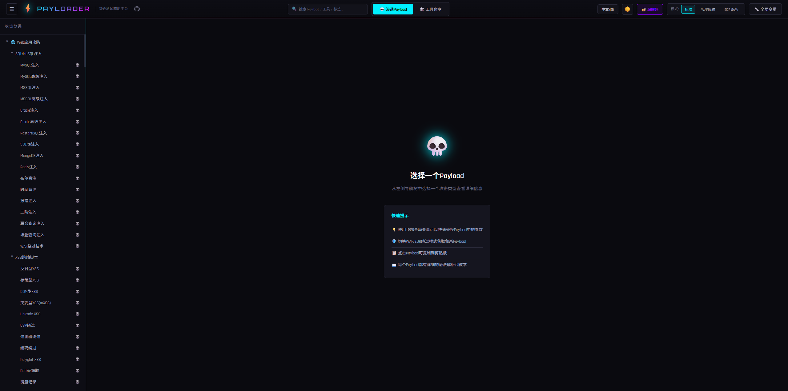
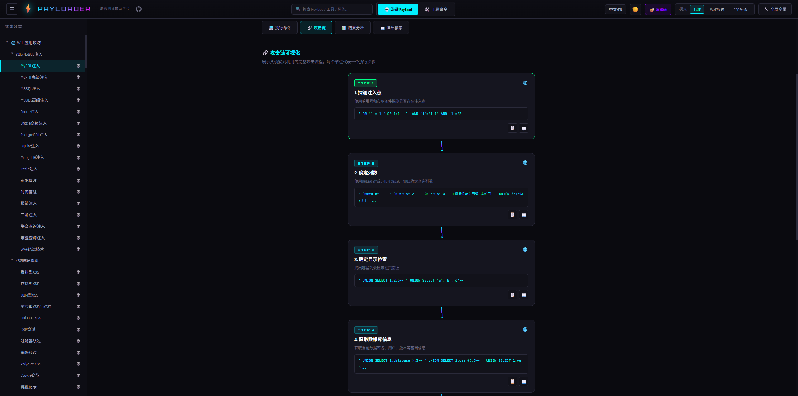
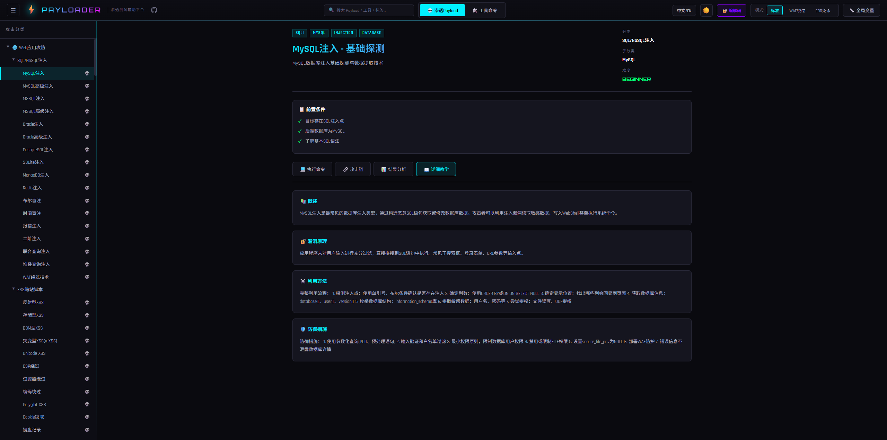
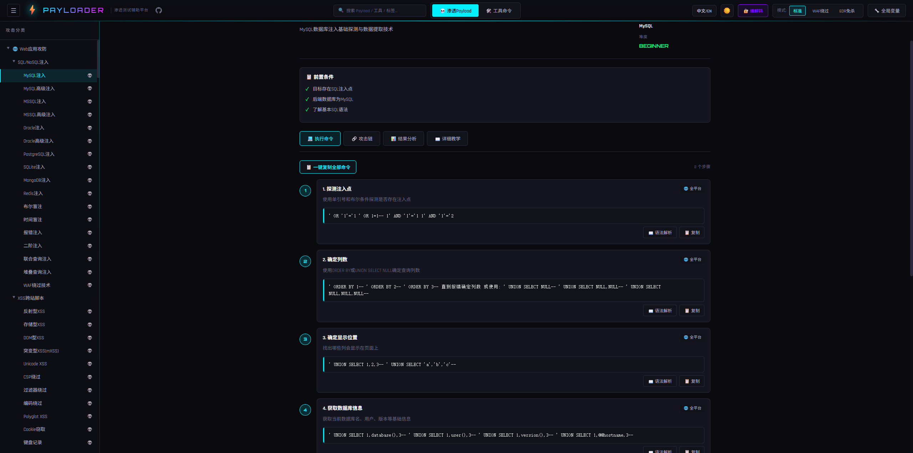
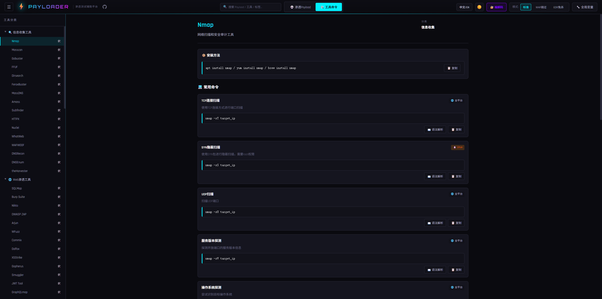
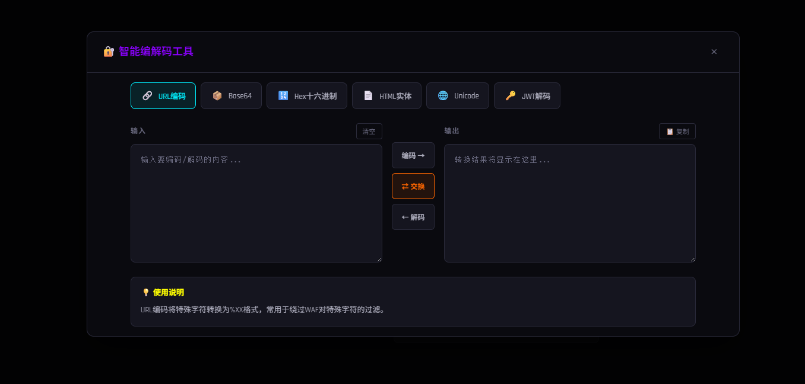

<div align="center">

# ⚡ Payloader — 渗透测试辅助平台

[](https://react.dev)
[](https://www.typescriptlang.org)
[](https://vite.dev)
[](LICENSE)
[](https://github.com/3516634930/Payloader)

</div>

---

## 📸 功能预览

### 主界面 — 攻击分类导航
> 左侧树形导航覆盖 23 类 Web 攻击 + 11 类内网渗透，右侧快速提示引导上手



### 🔗 攻击链可视化 — 从侦察到利用的完整路径
> **核心亮点**：每条 Payload 都配有可视化攻击链，以节点流程图展示从「探测注入点 → 确定列数 → 确定回显位 → 提取数据」的完整攻击步骤，新手也能一步步跟着打



### 🎓 详细教学 — 漏洞原理 + 利用方法 + 防御方案
> 每条 Payload 都附带完整教程：**概述 → 漏洞原理 → 利用方法 → 防御措施**，不只是给你命令，更教你为什么这么打



### 💻 执行命令 — 分步骤 + 语法解析 + 一键复制
> 每个步骤都有独立命令块，支持**语法高亮解析**（19 种颜色标注）和**一键复制**，直接拿去用



### 🛠️ 工具命令集 — 渗透工具速查手册
> 内置 Nmap、SQLMap、Burp Suite、Metasploit 等 114 条常用命令，每条都有中文说明和语法解析



### 🔐 编解码工具 — URL / Base64 / Hex / HTML / Unicode / JWT
> 内置智能编解码器，渗透过程中随时调用，支持 6 种编码格式互转



---

# 🇨🇳 中文文档

## 项目简介

**Payloader** 是一个中英双语的交互式安全载荷参考平台，面向安全研究人员、渗透测试工程师和红队成员。

项目汇集了 **300+ 条精心编排的攻防载荷**，涵盖 Web 应用安全与内网渗透两大领域，每条载荷均包含完整的攻击链步骤、语法高亮解析、WAF/EDR 绕过方案和学习教程。

> ⚠️ **免责声明**：本项目仅用于合法授权的安全测试、学习研究和防御加固。使用者须遵守当地法律法规，任何未经授权的攻击行为均与本项目无关。

## 功能特性

### 核心能力

| 功能 | 说明 |
|------|------|
| **178 条 Web 载荷** | 23 个分类 — 从经典 SQL 注入到 AI 安全 |
| **129 条内网载荷** | 11 个分类 — 信息搜集、凭据窃取、横向移动、域攻击 |
| **114 条工具命令** | Nmap、SQLMap、Burp Suite、Metasploit 等 |
| **完整攻击链** | 每条载荷包含侦察→识别→利用→后渗透步骤（3步以上） |
| **WAF/EDR 绕过** | 176 条 Web 载荷包含专用绕过变体 |
| **语法高亮解析** | 4,700+ 条语法分解条目，19 种颜色标注类型 |
| **学习教程** | 177 条载荷含完整教程（概述/漏洞原理/利用方式/防御方案） |

### 交互功能

| 功能 | 说明 |
|------|------|
| 🌐 **中英双语切换** | 一键切换中文/英文界面，默认中文 |
| 🌓 **暗黑/明亮模式** | 用户级主题偏好，自动保存 |
| 🔗 **攻击链可视化** | 节点式攻击步骤流程图 |
| 📋 **一键复制** | 复制单步或全部命令，支持变量替换 |
| 🔍 **全局搜索** | 按名称/描述/标签/分类实时模糊搜索 |
| 🔄 **全局变量替换** | 定义 TARGET_IP、DOMAIN 等变量，全平台自动替换 |

## 项目结构

```
Payloader/
├── public/                        # 静态资源
├── src/
│   ├── App.tsx                    # 入口 & 全局状态
│   ├── main.tsx                   # React 挂载点
│   ├── i18n/
│   │   └── index.ts               # 国际化系统 (中/英)
│   ├── components/
│   │   ├── Header.tsx             # 顶栏（主题/搜索/语言/变量）
│   │   ├── Sidebar.tsx            # 侧边导航（树形/搜索过滤）
│   │   ├── MainContent.tsx        # 主内容路由
│   │   ├── PayloadDetail.tsx      # 载荷详情（攻击链/复制/高亮）
│   │   ├── ToolDetail.tsx         # 工具命令详情
│   │   ├── SyntaxModal.tsx        # 语法分解弹窗（19种颜色）
│   │   └── EncodingTools.tsx      # 编解码工具
│   ├── data/
│   │   ├── webPayloads.ts         # Web载荷数据（18,700+行）
│   │   ├── intranetPayloads.ts    # 内网载荷数据（5,900+行）
│   │   ├── toolCommands.ts        # 工具命令数据（3,800+行）
│   │   └── navigation.ts         # 导航树定义
│   ├── types/
│   │   └── index.ts               # TypeScript 类型定义
│   └── styles/
│       └── global.css             # 全局样式（暗/亮主题变量）
├── index.html
├── vite.config.ts
├── tsconfig.json
└── package.json
```

## 技术栈

| 技术 | 版本 | 用途 |
|------|------|------|
| [React](https://react.dev) | 19.2 | UI 框架 |
| [TypeScript](https://www.typescriptlang.org) | 5.9 | 类型安全 |
| [Vite](https://vite.dev) | 8.0 (beta) | 构建工具 |
| 自研 i18n | - | 双语系统 |
| CSS Variables | - | 主题系统 |
| localStorage | - | 用户偏好持久化 |

**零外部 UI 依赖** — 无任何 UI 库，纯手写 CSS，极致轻量。


# 🇬🇧 English Documentation

## Screenshots

> See [📸 功能预览](#-功能预览) above for full screenshots — Attack Chain Visualization, Step-by-step Tutorials, Tool Commands, and Encoding Tools.

## About

**Payloader** is a bilingual (Chinese/English) interactive security payload reference platform for security researchers, penetration testers, and red teamers.

It features **300+ curated payloads** across Web application security and intranet penetration, each with complete attack chain steps, syntax-highlighted breakdowns, WAF/EDR bypass variants, and learning tutorials.

> ⚠️ **Disclaimer**: This project is for authorized security testing, learning, and defense hardening only. Users must comply with local laws. Any unauthorized attacks are unrelated to this project.

## Features

### Core

| Feature | Description |
|---------|-------------|
| **178 Web Payloads** | 23 categories — from classic SQL injection to AI security |
| **129 Intranet Payloads** | 11 categories — recon, credential theft, lateral movement, domain attacks |
| **114 Tool Commands** | Nmap, SQLMap, Burp Suite, Metasploit and more |
| **Full Attack Chains** | Each payload has recon → identify → exploit → post-exploit steps (3+) |
| **WAF/EDR Bypass** | 176 Web payloads include dedicated WAF bypass variants |
| **Syntax Highlighting** | 4,700+ syntax breakdown entries with 19 color-coded types |
| **Tutorials** | 177 payloads with full tutorials (overview / vulnerability / exploitation / defense) |

### Interactive

| Feature | Description |
|---------|-------------|
| 🌐 **Bilingual i18n** | Full Chinese ↔ English toggle, default Chinese |
| 🌓 **Dark / Light Mode** | Per-user theme with auto-saved preference |
| 🔗 **Attack Chain Visualization** | Node-based visual flow of attack steps |
| 📋 **One-click Copy** | Copy single step or all commands with variable substitution |
| 🔍 **Global Search** | Real-time fuzzy search by name / description / tag / category |
| 🔄 **Global Variables** | Define TARGET_IP, DOMAIN, etc. — auto-replace in all payloads |

## Project Structure

```
Payloader/
├── public/                        # Static assets
├── src/
│   ├── App.tsx                    # Entry & global state
│   ├── main.tsx                   # React mount point
│   ├── i18n/
│   │   └── index.ts               # i18n system (zh/en)
│   ├── components/
│   │   ├── Header.tsx             # Top bar
│   │   ├── Sidebar.tsx            # Side navigation
│   │   ├── MainContent.tsx        # Main content router
│   │   ├── PayloadDetail.tsx      # Payload detail
│   │   ├── ToolDetail.tsx         # Tool command detail
│   │   ├── SyntaxModal.tsx        # Syntax breakdown modal
│   │   └── EncodingTools.tsx      # Encoding/decoding tools
│   ├── data/
│   │   ├── webPayloads.ts         # Web payloads (18,700+ lines)
│   │   ├── intranetPayloads.ts    # Intranet payloads (5,900+ lines)
│   │   ├── toolCommands.ts        # Tool commands (3,800+ lines)
│   │   └── navigation.ts         # Navigation tree
│   ├── types/
│   │   └── index.ts               # TypeScript types
│   └── styles/
│       └── global.css             # Global styles (dark/light)
├── index.html
├── vite.config.ts
├── tsconfig.json
└── package.json
```

## Tech Stack

| Tech | Version | Purpose |
|------|---------|---------|
| [React](https://react.dev) | 19.2 | UI Framework |
| [TypeScript](https://www.typescriptlang.org) | 5.9 | Type Safety |
| [Vite](https://vite.dev) | 8.0 (beta) | Build Tool |
| Custom i18n | - | Bilingual System |
| CSS Variables | - | Theme System |
| localStorage | - | User Preference Persistence |

**Zero external UI dependencies** — no UI library, pure handwritten CSS.


## 📄 License

[MIT License](LICENSE)

---

